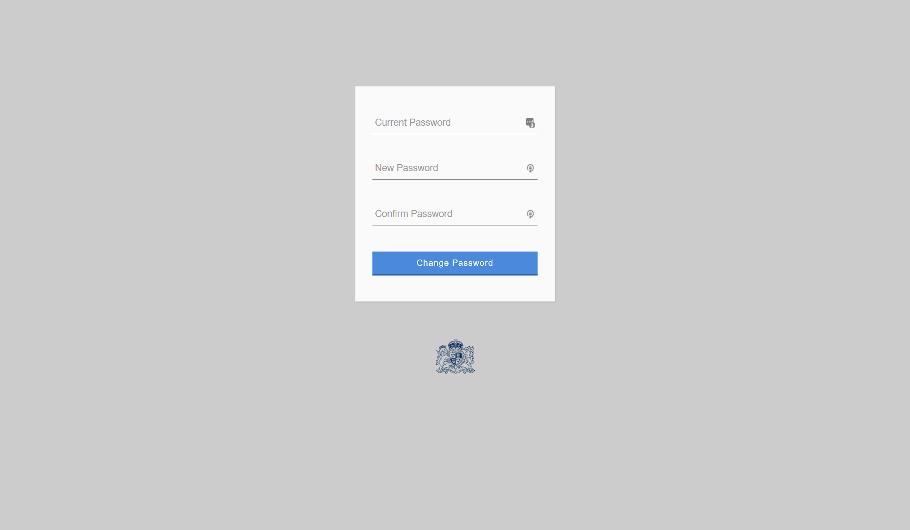
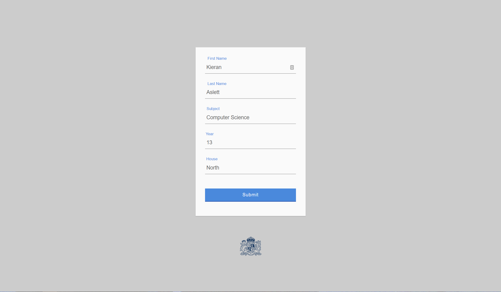
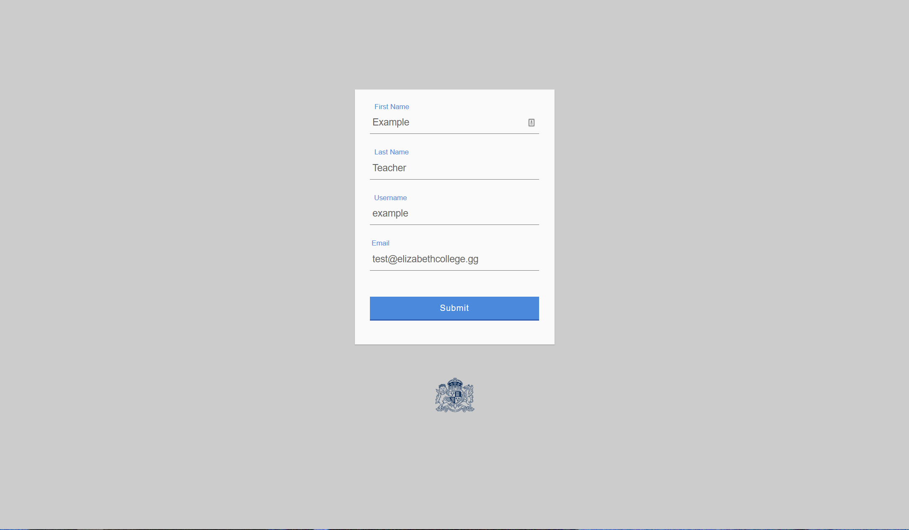

# Subject Support

## Homepage

The homepage is the primary page that the user will interact with, where students doing subject support will be listed and teachers will be able to mark each period as done, or both, and relay which ones have been completed.

## Add/Remove Students

This page is very similar to the homepage but instead of marking periods as complete it allows the user to add or remove students as well as edit existing students in the database. This page is only accessible by privilledged users.

## Add/Remove Teachers

This is a page where accounts can be added for the use of teachers, by default all users will not be priviledged. There are also options for editing and removing existing accounts. The current account cannot be removed. This page is only accessible by privilledged users.

## Other Features
* Password resets by emailing a code
* Password changing
* Login
* Logout

## Requirements
* Apache
* mysql (Optional phpMyAdmin)
* database named "subject_support"

## Setup
* Move documents into exposed apache folder
* Import "databaseStructure.sql" into "subject_support" database in mysql
* Navigate to the webpage
* Done!

## Defaults
* Admin Password - "Password01"
* Teacher Passwords - "Password01"

## Screenshots

### Home

### Students

### Teachers

### Change Password

### Edit Student

### Edit Teacher

